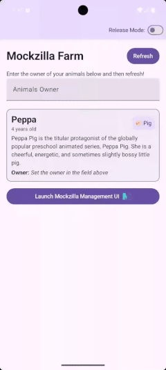
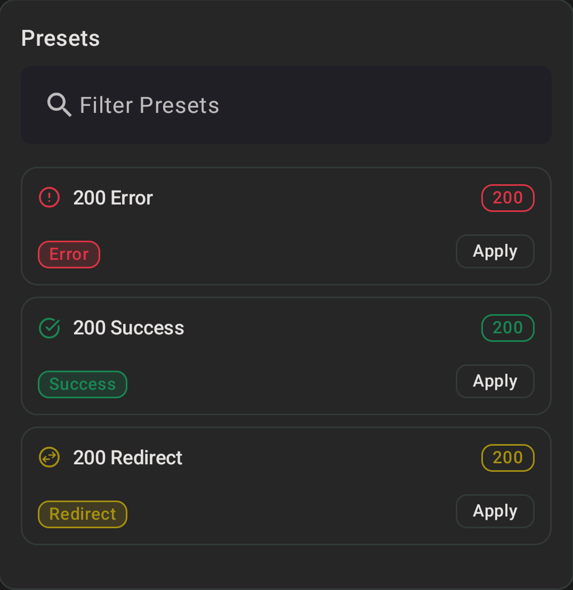

# Presets

Mockzilla responses can be changed and configured at runtime either using our [desktop app](../desktop/overview/) or
our [embedded UI](../mobile_ui/) that can be included in your app.

## What are presets?

Presets are pre-defined responses configured in code that can be applied at runtime.

## Defining presets

Presets are applied to individual endpoints, they can be successful responses, errors, or anything else!

=== "Kotlin"
    ```kotlin
        EndpointConfiguration
            .Builder("Pig")
            .configureDashboardOverrides {
                addPreset(
                    name = "George",
                    response = MockzillaHttpResponse(
                        body = Json.encodeToString(
                            AnimalDto(
                                name = "George",
                                age = 2,
                                biography = "George Pig is a fictional character...",
                            )
                        )
                    )
                )
                addPreset(
                    name = "Pig Failure",
                    response = MockzillaHttpResponse(statusCode = HttpStatusCode.NotFound)
                )
                ...
    ```
=== "Swift"
    ```swift
        EndpointConfigurationBuilder(id: "Pig")
            .configureDashboardOverrides { builder in
                    builder.addPreset(
                        response: MockzillaHttpResponse(
                            status: HttpStatusCode.OK,
                            headers: [:],
                            body: AnimalDto(
                                name: "George",
                                age: 2,
                                biography: "George Pig is a fictional character...",
                            ).toJson()
                        ),
                        name: "George",
                        description: nil,
                        type: nil
                    )
                }
    ```
=== "Flutter"
    ```dart
    EndpointConfig(
      name: "Pig",
      ...
      dashboardOptionsConfig: DashboardOptionsConfig(presets: [
        DashboardOverridePreset(
            name: "George",
            response: MockzillaHttpResponse(
              statusCode: 200,
              headers: {},
              body: AnimalDto(
                name = "George",
                age = 2,
                biography = "George Pig is a fictional character...",
              ).toJsonString(),
            )
        ),
        DashboardOverridePreset(
            name: "Pig Failure",
            response: MockzillaHttpResponse(
              statusCode: 404,
              headers: {},
              body: "",
            )
        )
      ])
    ```

## Applying Presets

The presets can be applied through the desktop app or the embedded UI.

### Embedded UI

Tapping an endpoint and scrolling down will show the full list of configured Presets.



## Preset Types

<div style="display: flex; flex-wrap: wrap; align-items: top; gap: 20px;">
  <div style="flex: 1;">
    <h3>Default Behaviour</h3>
    <p>By default the preset types are derived from the status code (defaulted to 200).</p>
  </div>
  <div style="flex: 1;">
    
  </div>
</div>

### Overriding 

This can be helpful if you're simulating an API that doesn't utilise status codes e.g using 200 even for errors.

=== "Kotlin"
    ```kotlin
    .configureDashboardOverrides {
        addPreset(
            name = "200 Error",
            response = MockzillaHttpResponse(statusCode = HttpStatusCode.OK),
            type = DashboardOverridePreset.Type.ServerError
        ).addPreset(
            name = "200 Success",
            response = MockzillaHttpResponse(statusCode = HttpStatusCode.OK),
            type = DashboardOverridePreset.Type.Success
        ).addPreset(
            name = "200 Redirect",
            response = MockzillaHttpResponse(statusCode = HttpStatusCode.OK),
            type = DashboardOverridePreset.Type.Redirect
        )
    }
    ```
=== "Swift"
    ```swift
    .configureDashboardOverrides { builder in
        builder.addPreset(
            name: "200 Error",
            description: nil,
            response: MockzillaHttpResponse(status: HttpStatusCode.OK),
            type: MockzillaDashboardOverridePresetType.servererror
        )
        builder.addPreset(
            name: "200 Success",
            description: nil,
            response: MockzillaHttpResponse(status: HttpStatusCode.OK),
            type: MockzillaDashboardOverridePresetType.success
        )
        builder.addPreset(
            name: "200 Redirect",
            description: nil,
            response: MockzillaHttpResponse(status: HttpStatusCode.OK),
            type: MockzillaDashboardOverridePresetType.redirect
        )
    }
    ```
=== "Flutter"
    ```flutter
        DashboardOptionsConfig(presets: [
            DashboardOverridePreset(
                name: "200 Error",
                response: MockzillaHttpResponse(statusCode: 200),
                description: null,
                type: DashboardOverridePresetType.serverError 
            ),
            DashboardOverridePreset(
                name: "200 Success",
                response: MockzillaHttpResponse(statusCode: 200),
                description: null,
                type: DashboardOverridePresetType.success
            ),
            DashboardOverridePreset(
                name: "200 Redirect",
                response: MockzillaHttpResponse(statusCode: 200),
                description: null,
                type: DashboardOverridePresetType.redirect
            ),
      ])
    ```

